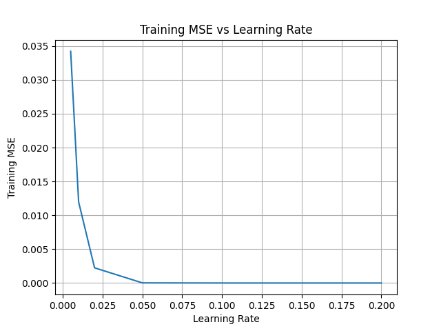
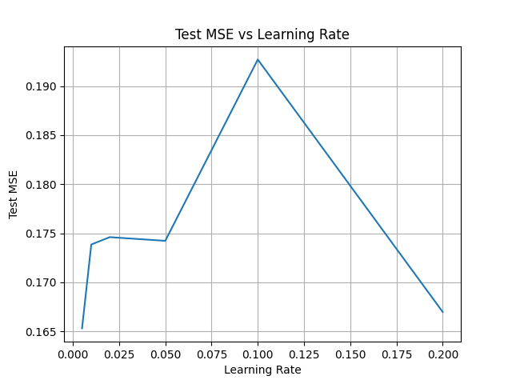

## The Dataset 

The dataset contains information about performance records and salaries of baseball players from the 1986 and 1987 seasons. The columns of the dataset are the following:

- **AtBat**: Number of times at bat in 1986.
- **Hits**: Number of hits in 1986.
- **HmRun**: Number of home runs in 1986.
- **Runs**: Number of runs in 1986.
- **RBI**: Number of runs batted in 1986.
- **Walks**: Number of walks in 1986.
- **Years**: Number of years in the major leagues.
- **CAtBat**: Number of times at bat in the career.
- **CHits**: Number of hits in the career.
- **CHmRun**: Number of home runs in the career.
- **CRuns**: Number of runs in the career.
- **CRBI**: Number of runs batted in the career.
- **CWalks**: Number of walks in the career.
- **League**: A factor with levels A and N indicating player's league at the end of 1986.
- **Division**: A factor with levels E and W indicating player's division at the end of 1986.
- **PutOuts**: Number of put outs in 1986.
- **Assists**: Number of assists in 1986.
- **Errors**: Number of errors in 1986.
- **Salary**: 1987 annual salary on opening day in thousands of dollars.

The target variable is the `Salary` variable, while the others are predictor variables.

## Data Processing 

The CSV is loaded into a pandas DataFrame and rows with missing values are dropped. The `Salary` column is log-transformed due to the fact that 
such column is strongly right-skewed since there could be players that earn much more than the remaining players. In fact, the skewness of `Salary` is of 1.59, while of log-transformed `Salary` is of -0.18. The computation of the skewness can be seen [here](#appendix).

Categorical predictors are one-hot encoded using `OneHotEncoder` combined with `ColumnTransformer`. The preprocessing steps are fit and transformed on the training set and then applied to the the test set to avoid data leakage. 

## Results 

We fit an gradient boosting model in order to study how different learning rates (also known as the shrinkage parameter) affect both the training and test mean squared error. In order to isolate just this parameter, others such as the maximum depth of the trees, number of trees to use and cost complexity parameter are fixed with values 3, 1000 and 0, respectively.

The learning rates considered are 0.005, 0.001, 0.02, 0.05, 0.1 and 0.2. The training and test MSEs (for our run) are present in the following table:

| Learning Rate | Training MSE | Test MSE |
|:------------:|:------------:|:--------:|
| 0.005 | 0.03422889831030116 | 0.165313912773685 |
| 0.01 | 0.011974644860235991 | 0.17385612182929697 |
| 0.02 | 0.0022414128681371476 | 0.17460507564961442 |
| 0.05 | 1.843096336856934e-05 | 0.17422841687621815 |
| 0.1 | 9.280441875432287e-09 | 0.19270211234902365 | 
| 0.2 | 2.613027581726305e-15 | 0.1669740929630061 | 

For the training MSE, we observe the expected behavior: increasing the learning rate increases the size of each boosting update, so with enough trees the model can fit the training data extremely closely, resulting in very low training errors. However, the test error does not follow the same monotonic pattern. In fact, it follows an inverted U-shape, showing it varies with the learning rate exhibiting noticeable fluctuations and some overfitting. A possible mitigation of this effect might be tuning the learning rate and the number of trees jointly, that is, for example, using fewer trees as the learning rate increases.

We then measured the importance of all the predictors in this boosting scenario and the top three are: `CAtBat`, `CHits` and `CRuns`. 

Plots of the training and testing MSEs follow below:





## Conclusion

Across all diferent values of learning rate, we verify that the training MSE is lowest for the highest training rate, where the model fits the training data extremely closely. The test MSE, however, follows a contrary trend, where it is the lowest for the lowest learning rate and the highest for the highest learning rate. This shows that the model overfit the training data in this scenario.


## Appendix

The skewness of `Salary` was computed using 

```
import scipy as sp
sp.stats.skew(csv_to_df('path')['Salary']) 
``` 


